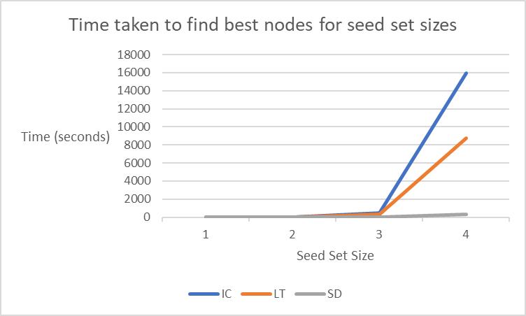

# CSCI-4834-project

Final project for CSCI 4834 (Complex Network) course.
Explored Influence Maximization Models on Social Networks. 

Used two of the popular methods used in that field: Independent Cascade (IC) and Linear Threshold (LT). Proposed as far as I am aware Stored Diffusion (SD), inspired by [Rainbow Table](https://en.wikipedia.org/wiki/Rainbow_table) from cyber security and [Memoization](https://en.wikipedia.org/wiki/Memoization#:~:text=In%20computing%2C%20memoization%20or%20memoisation,the%20same%20inputs%20occur%20again.), which consist of storing/caching the influence of each node thus significantly reducing the time taken to run the main influence simulation.

Moreover, the influence of each node can be determined outside of the main simulation thus we are able to:

-   Implement more complex diffusion algorithm for each node.
-   Run the per node influnce in **parallel** as well as **asynchronously**.

## References

**Thank you** to the following resources:

-   Code inspired by the following repo: https://github.com/dimgold/pycon_social_networkx
-   Dataset used: https://www.kaggle.com/datasets/ruchi798/star-wars?select=starwars-full-interactions-allCharacters-merged.json
